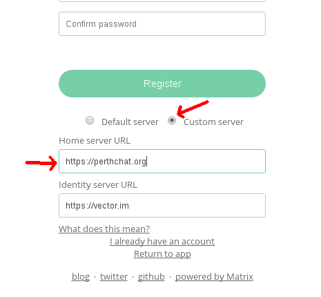
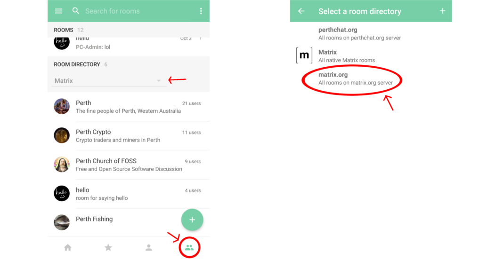
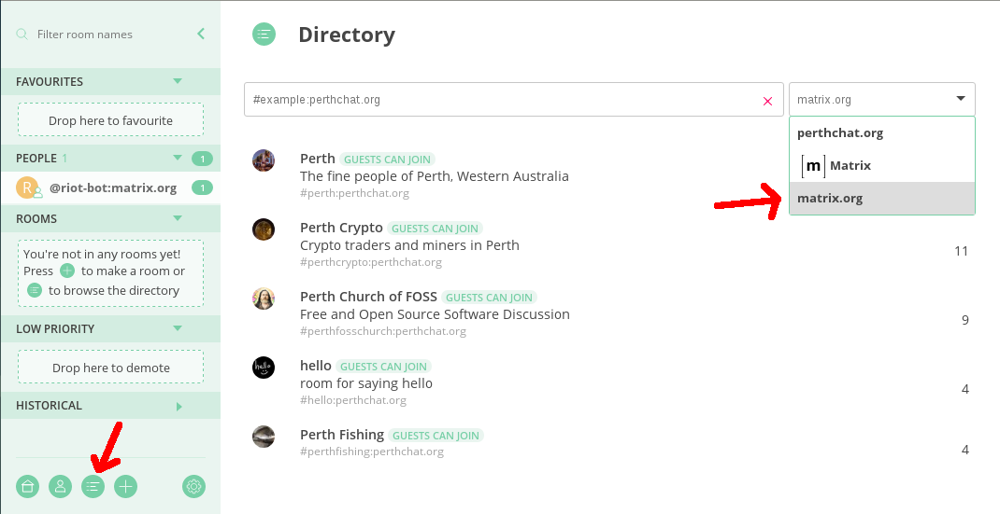

.. contents::

PerthChat User Guide
====================

Perthchat is a Matrix server hosted for Perth, Matrix has chatroom functions, E2E IM + Voice/Video calling and bridged networks (IRC), all across a federated network of community run servers.

The service was created to provide a secure, open source and ad-free messaging experience with no strings attached.

Why use perthchat.org?
======================

- Run by privacy advocates, not ad companies.
- Service is made with 100% Free and Open Source Software.
- E2E messenging and voice/video calling.
- No number or email registration required.
- Free to the public, forever.

How do I use PerthChat online?
==============================

Just visit https://perthchat.org and click 'register'.

Can i use it without registering?
=================================

Yes, just try and enter the room you wish to join on the browser, you'll be prompted to set a username.

How do I use PerthChat with the Desktop/Mobile software?
========================================================

1. Download, install and open the Riot software, this is the original Matrix client: https://about.riot.im/downloads/

2. Select 'Register' or 'Create an account'.

3. Select ‘Custom Server’ and change ‘https://matrix.org’ to ‘https://perthchat.org’:

4. Enter desired username and password and click ‘Register’.

Note: If the username you set was ‘Stewo’ then your full Matrix ID would be:
@Stewo:perthchat.org (case sensitive)

What should I do after logging in?
==================================

- Join some rooms! Or create your own.
- Set a personal avatar.
- Add an email or phone number for recovery.
- Practise enabling encryption and comparing keys through another medium.
- Clean up your device keys in settings, logging in by browser can generate too many e2e keys.
- Try message the admin: ‘@PC-Admin:perthchat.org’
- Get your friends and family on Perthchat to complete the experience.

How do I browse more rooms?
===========================

On mobile select the ‘rooms’ category at the bottom, then select the ‘Room Directory’ dropdown. Select ‘matrix.org’ when prompted. The new room list will take a minute to load.

On desktop/browser, select the ‘Room directory’ option in the bottom left corner, then select ‘matrix.org from the dropdown in the top right corner.

Can I donate or help?
=====================

Perthchat.org is currently quite cheap to run. We need people to help and encourage others to connect to perthchat.

Matrix.org needs more funding to help develop Matrix and bring it out of beta, If you want to support us, consider donating to them:
https://matrix.org/blog/2017/07/07/a-call-to-arms-supporting-matrix/

