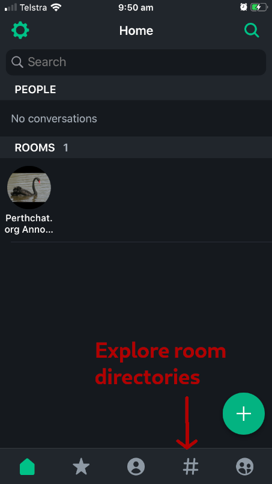
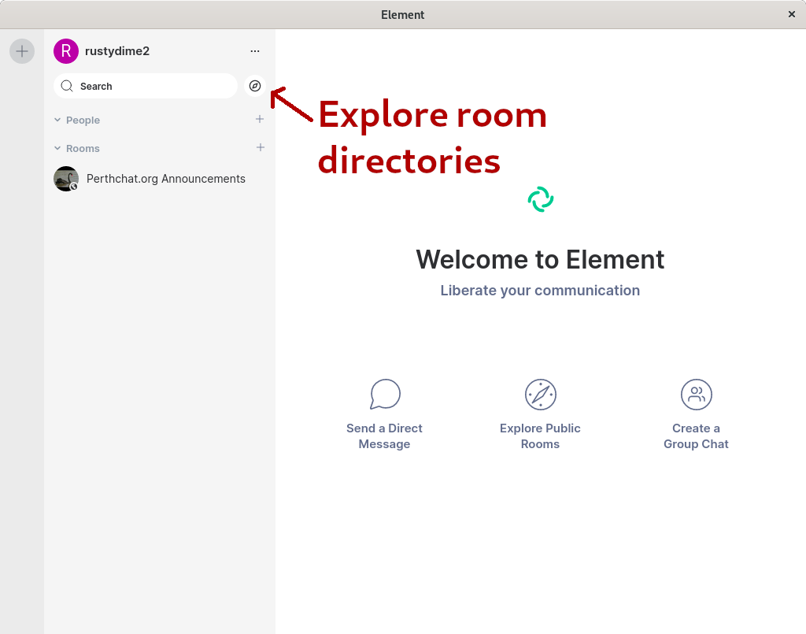

.. contents::

PerthChat User Guide
====================

Perthchat is a Matrix server hosted for Perth, Matrix has chatroom functions, E2E IM + Voice/Video calling and bridged networks (discord/irc), all across a federated network of community run servers.

The service was created to provide a secure, open source and ad-free messaging experience with no strings attached.

Public rooms are also bridged to the 'Perth' Discord server: https://discord.gg/Qth5vG3

Why use perthchat.org?
======================

- Run by privacy advocates, not ad companies.
- Service is made with 100% Free and Open Source Software.
- E2E messenging and voice/video calling.
- A fun enviroment with lenient moderation standards.
- No number or email registration required.
- Free to the public, forever.

How do I use PerthChat online?
==============================

Just visit https://client.perthchat.org and click 'register'.

How do I use PerthChat with the Desktop/Mobile software?
========================================================

1. Download, install and open the Riot software, this is the original Matrix client: https://about.riot.im/downloads/

2. Select 'Register' or 'Create an account'.

3. Select "custom server" and change ‘https://matrix.org’ to ‘https://matrix.perthchat.org’:

4. Enter desired username and password and click ‘Register’.

.. image:: Mobile-Register.gif

.. image:: Desktop-Register.gif

Note: If the username you set was ‘Stewo’ then your full Matrix ID would be:
@stewo:perthchat.org

What should I do after logging in?
==================================

- Join some rooms! Or create your own.
- Set a personal avatar.
- Add an email or phone number for recovery.
- Practise enabling encryption and comparing keys through another medium.
- Clean up your device keys in settings, logging in by browser can generate too many e2e keys.
- Try message the admin: ‘@PC-Admin:perthchat.org’
- Get your friends and family on Perthchat to complete the experience.

How do I browse more rooms?
===========================

On mobile select the ‘rooms’ category at the bottom, then open the ‘Room Directory’ dropdown.

On desktop/browser, select the 'Explore rooms' compass option in the top left corner.

You can also type in other known homeservers here.

I joined an encrypted room and now i'm being asked to verify?
=============================================================

Ideally end-to-end encryption requires users to verify each others keys, although this isn't strictly required.

Follow the prompts to create a 'secure backup', save this password. Then 'cross-sign' your devices against each other, this creates a web of trust and allows you to recover e2ee messages from previous sessions.

You can then verify other peoples devices in the same way, now you can be certain your messages are headed to the right devices, and not to an intruder who's trying to MITM your conversations.

Can I donate or help?
=====================

Trying to get your friends and family onto the service is helpful. We are also interested in other administrators who want to help us configure custom bridges/integrations/bots for the service.

Matrix.org needs more funding to help develop the Matrix, if you want to support us, consider donating to them:
https://matrix.org/blog/2017/07/07/a-call-to-arms-supporting-matrix/

