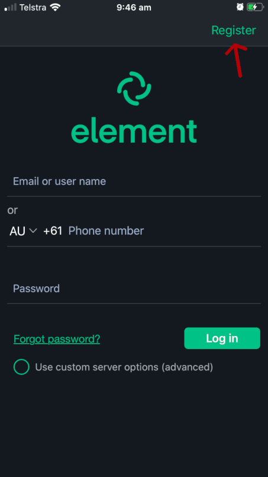

.. contents::

PerthChat User Guide
====================

Perthchat is a Matrix server hosted for Perth, Matrix has chatroom functions, E2E IM + Voice/Video calling and bridged networks (discord), all across a federated network of community run servers.

The service was created to provide a secure, open source and ad-free messaging experience with no strings attached.

Why use perthchat.org?
======================

- Run by privacy advocates, not ad companies.
- Service is made with 100% Free and Open Source Software.
- E2E messenging and voice/video calling.
- No number or email registration required.
- Free to the public, forever.

How do I use PerthChat online?
==============================

Just visit https://perthchat.org and click 'register'.

How do I use PerthChat with the Desktop/Mobile software?
========================================================

1. Download, install and open the Riot software, this is the original Matrix client: https://about.riot.im/downloads/

2. Select 'Register' or 'Create an account'.

3. Select "custom server" and change ‘https://matrix.org’ to ‘https://perthchat.org’:

4. Enter desired username and password and click ‘Register’.

.. image:: Desktop-Register.gif

Note: If the username you set was ‘Stewo’ then your full Matrix ID would be:
@Stewo:perthchat.org (case sensitive)

What should I do after logging in?
==================================

- Join some rooms! Or create your own.
- Set a personal avatar.
- Add an email or phone number for recovery.
- Practise enabling encryption and comparing keys through another medium.
- Clean up your device keys in settings, logging in by browser can generate too many e2e keys.
- Try message the admin: ‘@PC-Admin:perthchat.org’
- Get your friends and family on Perthchat to complete the experience.

How do I browse more rooms?
===========================

On mobile select the ‘rooms’ category at the bottom, then open the ‘Room Directory’ dropdown. Select ‘matrix.org’ when prompted. The new room list will take about a minute to load so be patient.

.. image:: Mobile-Rooms.gif

On desktop/browser, select the ‘Room directory "+"’ option in the left column, then select ‘matrix.org' from the dropdown in the top right corner.

.. image:: Desktop-Rooms.gif

You can also type in other known homeservers here.

I joined an encrypted room and now i'm being asked to verify?
=============================================================

Ideally end-to-end encryption requires users to verify each others keys, although this isn't strictly required.

**Do not click the 'verify' button**, first call the person you are trying to perform this verification with using another medium. (eg: phone/facebook) Then attempt the verification.

If you don't want to call them and are feeling a bit lazy, click 'send anyway', there is no point in you attempting verification if you don't first contact that person through another medium.

Can I donate or help?
=====================

Sure, the service costs about $200 USD a year to run, some help paying for it would be great:

.. image:: Bitcoin_Address.png

BTC: bc1q92x9rexsr7yvghmyjkdjg8th8f2xyctfuwr4dl

Matrix.org needs more funding to help develop the Matrix, if you want to support us, consider donating to them:
https://matrix.org/blog/2017/07/07/a-call-to-arms-supporting-matrix/

